# Exercício 2 - Configuração de Cache

Neste exercício será avaliada a melhor configuração para as caches L1 de instruões da dados. Para isso serão utilizados quatro programas dos presentes na lista de traces oferecidas, estas são: `gzip_f2b`, `gcc_m2b`, `mesa_f2b` e `gap_m2b`.

Todas as avaliações seguintes foram feitas levando em consideração a tava de misses na cache. Ao final do relatório será discutido se apenas este valor é suficiente.

## Dados coletados

### Tamanho da L1 cache

Inicialmente foi avaliado o melhor tamanho da cache. Neste teste fizemos a verificação para 2KB, 4KB, 8KB, 16KB, e 32KB.

Os valores de tamanho do bloco e associatividade foram mantidos os padrões do dinero para as medições (32b e 1, respectivamente).

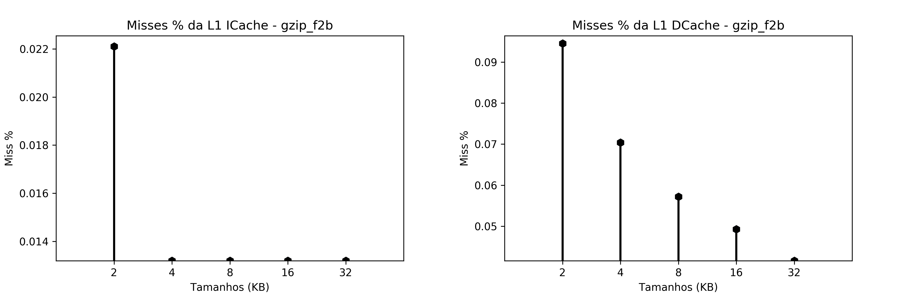

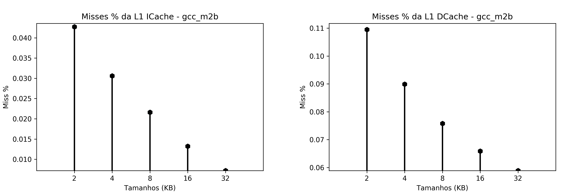

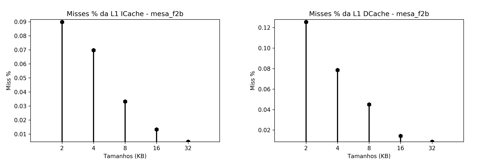

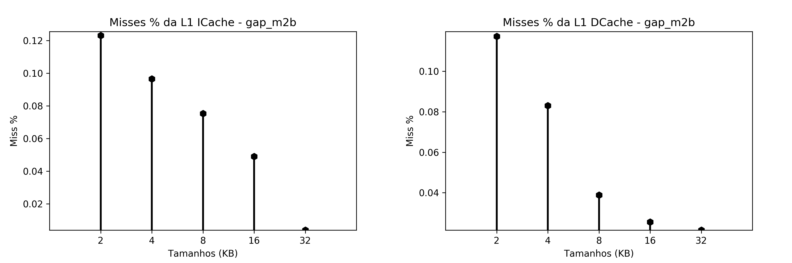

Para todos os gráficos acima é facil parceber que a cache de 32KB apresenta a menor taxa de misses. Assim, este é o tamanho da nossa cache "ótima" que utilizaremos.

É possível também perceber que a taxa de misses sempre descrece quanto maior é a cache. Não utilizamos valores maiores que os apresentados pois tomamos como referência os tamanhos das caches L1 dos processadores da linha Nahalem da Intel (core i7), que também possum 32K para instruções e dados.

### Tamanho dos blocos

Para as medições do tamanho dos blocos foram testados os valores 2, 4, 8, 16 e 32 bits. O tamanho da cache foi o valor óimo do teste anterior e o valor da associatividade é o padrão (1).

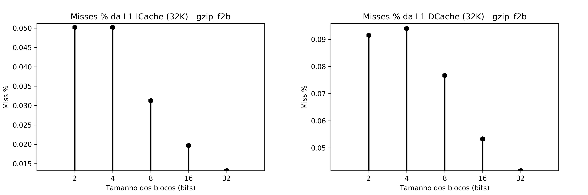

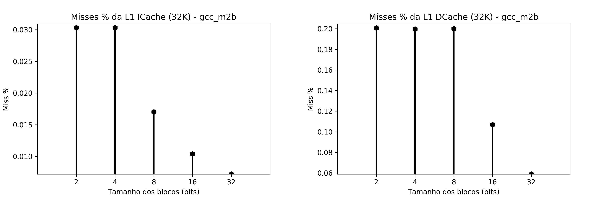

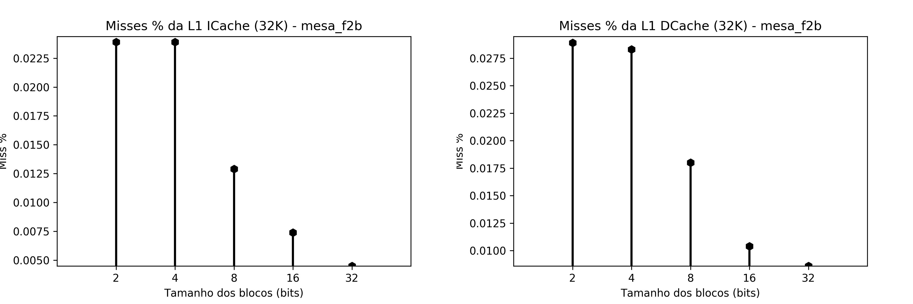

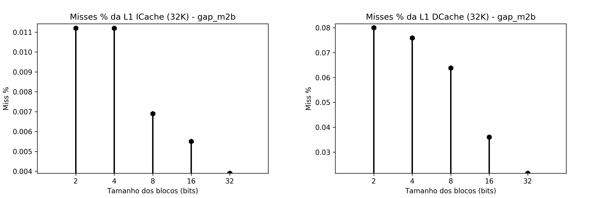

Novamente é simples de perceber que o melhor tamanho para os blocos (seguindo a nossa análise), são os blocos com 32 bits.

### Associatividade

Para associatividade foram testados 1 (direct mapped), 2, 4, 16, 32, 64, 128, 256, 512, 1024 (fully associative). Todas as medições feitas com a cache "ótima" obtida até o momento.

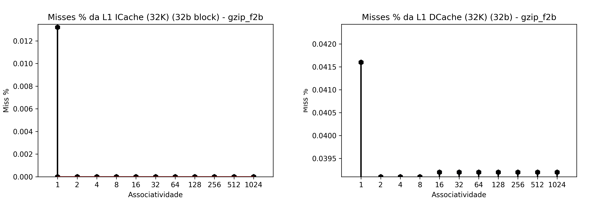

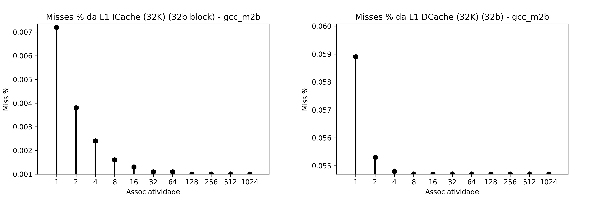

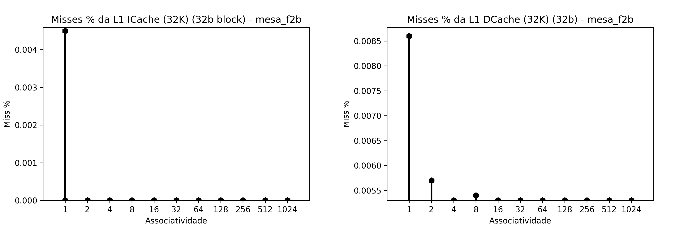

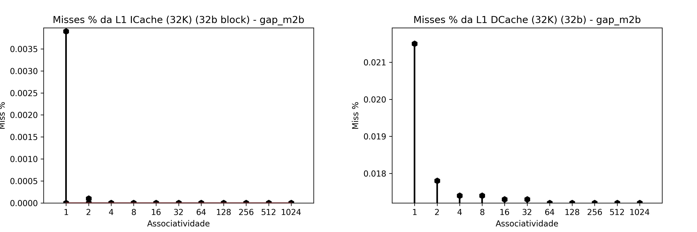

Antes de definir as melhores associatividades para as caches, podemos avaliar uma diferença interessante entre as caches de intrução e de dados. Na cache de instruções, em quase todos os programas a tava de misses se torna nula já para associatividade 2, enquanto que para os dados, apesar dos misses se manterem constantes em algun ponto, eles não zeram.

Podemos concluir que como os dados devem ser bem mais abundantes e mais variados, de forma que mesmo em uma cache totalmente associativa, a cache pode ser enchida, de forma que seja necessária uma rotatividade dos dados, e deve ser mais comum buscar um novo dado não presente na cache.

Já as instruções devem ser menos abundantes e menos variadas, pois o programa deve usar um set de instruções com muita frequência. Assim, muitas das insturções devem ser colocadas em cache e não ocorrem misses mais para aquela instrução.

Para definir os melhores valores escolheremos o primeiro valor que tenha a menor tava de misses entre todos os programas. Se não existir um, o valor que possua a menor tava de misses em mais programas.

Para as instruções, a melhor associatividade seria 128, pois a partir dela todas as taxas de misses são as menores possíveis, se mantendo para associatividades maiores, sendo essas então não necessárias

Para os dados, podemos dizer que a melhor é 64, seguindo a mesma ideia da escolha para a cacge de instruções.

## Avaliação do método

### Tempo

Acima utilizamos para a avaliação das caches a tava de misses, que é o valor mais relevante informado pelo dinero. Acontece que um outro critério seria essencial, e este é o tempo gasto pela cache, no caso, o tempo de miss.

O tempo é de extrema importância pois, como foi visto acima, principalmente na associatividade, para associatividades muito altas, a tava de misses se torna quase nula, ou pelo menos se mantem em um valor constante (o que se dá pelo limite de tamanho da cache). Acontece que, quanto maior a associatividade, maior o tempo necessário para encontrar o dado procurado.

Um exemplo disso é que em uma cache direct mappep a busca é direta, o SO precisa apenas acessar a posição de memória designada ao bloco. Já em uma cache fully associative, qualquer bloco pode se encontrar em qualquer posição da cache, assim, é preciso percorrer toda a cache buscando o bloco.

Assim, é preciso fazer uma avaliação entre a taxa de misses e o tempo para esses misses para fazer uma avaliação mais realista. Sendo assim, dificilmente a associatividade encontrada para as isntruções (128) é realmente uma boa escolha, considerando que as buscas seriam muito caras. Usando como referência, na linha Nahalem da Intel, a associatividade das caches é 4.

### Preço

Este é um critério mais voltado a mercado. Uma cache muito grande, além de poder se tornar mais lenta, também seria muito cara, o que pode ser enviável para produção.

## Conclusão

Podemos concluir que para avaliar caches, as duas informações mais importantes são cache misses e o tempo de busca na cache (no caso o tempo de miss). Sem essas duas informações, podemos obter valores e atingir conclusões equivocadas quanto à eficiência da cache.
