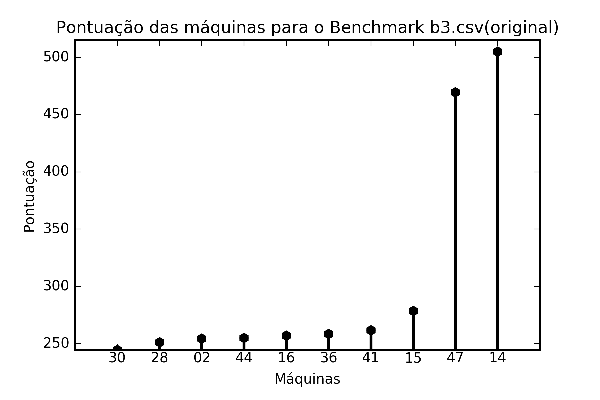
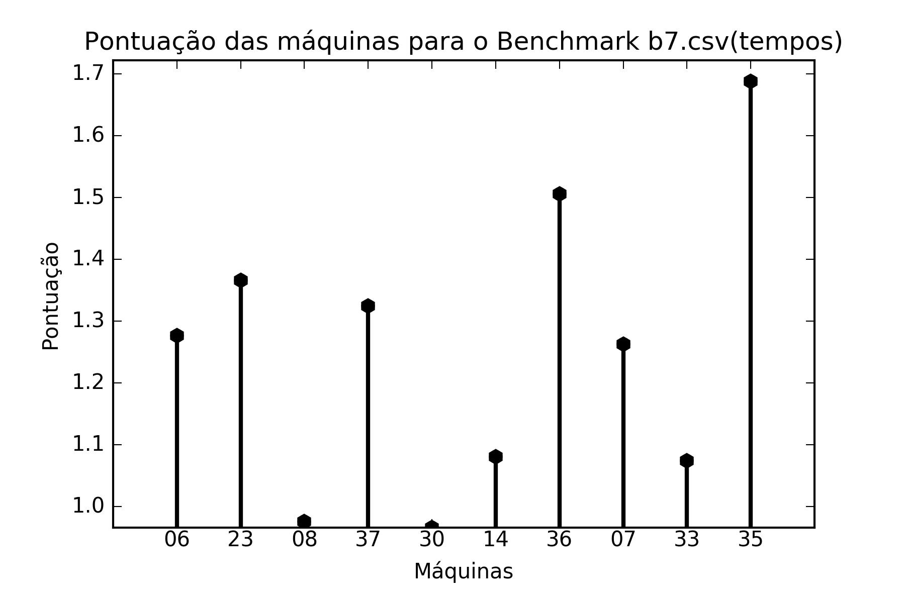
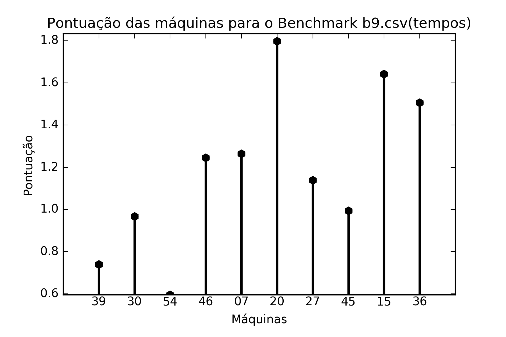
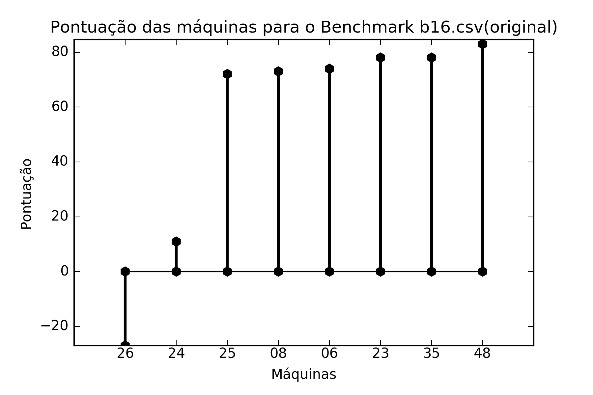
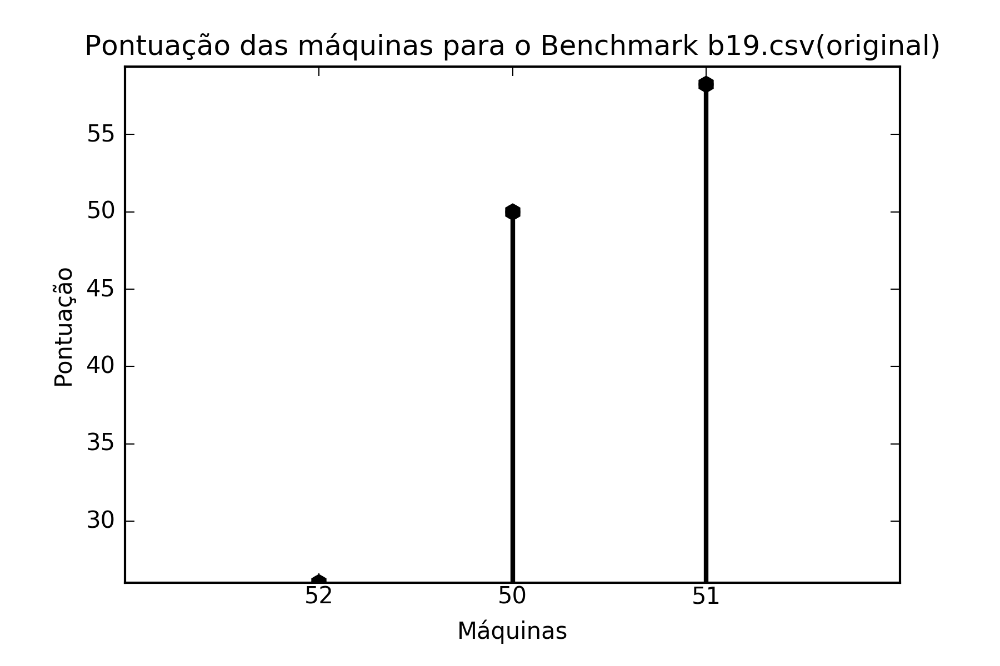

# Trabalho 1 - Parte 3 - Análise dos benchmarks

Nesta etapa do trabalho irei analisar os resultados obtidos (na parte 2) pelos benchmarks desenvolvidos na parte 1.

A análise ocorrerá inicialmente por benchmark, analisando se os valores dos scores obtidos em cada benchmark faz sentido para cada máquina.

Para realizar uma análise geral com todos os valores que temos disponíveis com as medições de todos os grupos, para essa etapa foi criada um novo sistema de ranqueamento semelhante ao utilizado pelo SPEC.
Neste sistema teremos uma máquina de referência (no caso a 18, meu computador pessoal), e esta terá as medições de tempo para todos os benchmarks utilizados na parte 2:

| Benchmark | Tempo (s)     |
|-----------|---------------|
| 1         | 39.215325675  |
| 2         | 41.96995752   |
| 3         | 24.31         |
| 4         | 400.82752086  |
| 9         | 15.94589901   |
| 10        | 2.823875      |
| 14        | 28.284635648  |
| 15        | 156.294801355 |
| 16        | 26.183        |
| 17        | 145.059393290 |
| 18        | 22.9681       |
| 19        | 8.300         |

O benchmark 7, apesar de ser utilizado nas análises abaixo, não tem tempo representado acima pois os tempos de execução das máquinas para este benchmark nas planilhas nao foi dado.
Assim não foi possível utilizar os dados deste benchmark para calcular os novos scores.

Os novo score foi calculado realizando a divisão entre a média geométrica dos tempos da máquina de referência e os tempos da máquina em questão (usando apenas os benchmarks para os quais que a máquina em questão possui medição, claro):


Sendo, na imagem acima Tri o tempo da máquina de referência para o benchmark i e Tmi o mesmo para a máquina que estamos medindo o score.

Com esse novo score foi possível criar um gráfico de pontuação que possua todas as máquinas utilizadas no projeto:


(As máquinas 1, 5, 29, 49 e 53 possuem pontuação 0 devido ao fato de não terem sido usadas em nenhuma medição).

O gráfico acima deixa claras algumas incongruências com o score. O exemplo máximo é com a máquina de maior pontuação, a número 16, um pc da sala 320 do IC-3. Suas especificações são

```
Intel(R) Core(TM) i5-4590 CPU @ 3.30GHz x 4, 64k L1, 256k L2, 6M L3, 8GB RAM, 1TB 7200RPM
```

e esta máquina está melhor ranqueada do que, por exemplo, a máquina 17:

```
Intel® Core™ i7-3770K CPU @ 3.50GHz × 8   8gb ram
```
Mas mesmo esse resultado paracendo errado, veremos abaixo como a máquina 16 apresentou bons tempos e scores para praticamente todos os benchmarks.

Isso aconteceu neste modelo de medição pois as máquinas são ranqueadas utilizando benchmarks diferentes e apesar dos valores serem normalizados, cada benchmark, por não ser um programa ou um conjunto de programas bem definido para medir todas as capacidades do computador, fazem levantamentos de características distintas de cada máquina.

Mas mesmo assim esses valores podem servir como uma linha geral para avaliar as máquinas. Infelizmente quase todos os computadores utilizados são muito semelhantes, com processadores `i5` e `i7`, o que não mostra grandes variações.

Mas é possível perceber que máquinas bem menos potentes, como 43, 55, 2, 52, 40 e 56:

```
Intel Pentium(R) Dual-Core - CPU T4300 @2.10 GHz, L1 32k, L2 32k, L3 1Mb, 2GB DDR2, HD 250 Gb.

Inter(R) Core(TM)2 Duo E4500 @ 2.2GHz L1: 32K L2: 2048K, 2GB DDR2 1331MHz HD: 320GB

Intel Pentium 1.6 GHz, 4 cores, 32K L1, 1MB L2, 4GB DDR4, 465 GB 5200RPM

Intel(R) Core(TM)2 Quad CPU    Q8400  @ 2.66GHz

Architecture: x86_64 Intel(R) Core(TM)2 Quad CPU  Q8400  @ 2.66GHz L1d cache: 32K L2 cache:2048K

AMD APU A10-5750M @2.5 - 3.2 GHz L1:192k L2:4096k, 4gb DDR3 1600mhz, GPU: R9 M290x , HD 1tb 7200 rpm, VirtualBox
```
têm pontuações bem baixas, o que faz com que o sistema possua uma certa consistência, apesar de alguns "soluços", como a máquina 50, entre a 55 e a 2:

```
Intel(R) Core(TM) i7-4750HQ CPU @ 2.00GHz; Memory 8 GB 1600 MHz DDR3; Mac OS X El Capitan (version 10.11.4)
```

Tendo conhecimento destas informações podemos começar a analisar os benchmarks separadamente.

Para cada benchmark abaixo será mostrado um gráfico com as pontuações criadas pelo grupo responsável pelo benchmark e um gráfico com as pontuações definidas neste relatório.

## Benchmark 1 - Gnuplot
O score de B1 é calculado por:

N = (0.4*ET/ET' + 0.1*BM/BM' + 0.2*IPC'/IPC + 0.1*L1M/L1M' + 0.2*BC/BC') * 50

Sendo:
```
ET - elapsed-time
BM - branch-misses
IPC - instructions-per-cycle
L1M - L1-cache-misses
BC - bus-cycles
```
Sendo X' o valor relativo à maquina sendo testada e X o valor da máquina base (11). Sendo assim, o método de ranqueamento é semelhante ao definido no início do relatório.

Máquinas utilizadas:

```
43: Intel  Pentium(R) Dual-Core - CPU T4300 @2.10 GHz, L1 32k, L2 32k, L3 1Mb, 2GB DDR2, HD 250 Gb.
55: Inter(R) Core(TM)2 Duo E4500 @ 2.2GHz L1: 32K L2: 2048K, 2GB DDR2 1331MHz HD: 320GB
40: Architecture: x86_64 Intel(R) Core(TM)2 Quad CPU  Q8400  @ 2.66GHz L1d cache: 32K L2 cache:2048K
21: Intel Core 2 Quad Q8400 2.66 GHz, 64k L1, 2M L2, 4GB RAM, 250GB 7200RPM
31: Intel® Core™ i7-2670QM  2.20GHz L1: 32K, L2: 256K, L3: 6144K, 8GB DDR3
32: Intel(R) Core(TM) i5-4590 CPU @ 3.30GHz L1: 32K, L2: 256K, L3: 6144K
22: Intel® Core™ i5-4590 CPU @ 3.30GHz × 4 L1: 32K, L2: 256K, L3: 6144K,, 7,7 GiB memory, fedora 23 64-bit,
26: Intel® Core™ i5-4590 CPU @ 3.30GHz × 4 , 7.7 GiB RAM, Intel® Haswell Desktop, 266.5 GB
25: Intel Core i7 2.7 GHz 3612QM, 8 GB DDR3
35: Intel(R) Core(TM) i5-3570 CPU @ 3.40GHz  L1d cache: 32K L1i cache: 32KL2 cache: 256K L3 cache: 6144K
36: Intel® Core™ i5-4590 CPU @ 3.30GHz × 4 L1: 32K, L2: 256K, L3: 6144K,, 7,7 GiB memory, fedora 23 64-bit,
33: Intel® Core™ i5-4590 CPU @ 3.30GHz × 4 L1: 32K, L2: 256K, L3: 6144K,, 7,7 GiB memory, fedora 23 64-bit,
52: Intel(R) Core(TM)2 Quad CPU    Q8400  @ 2.66GHz
07: Intel Core i5 3.3 GHz, 4 Cores, 32K L1, 256K L2, 6M L3, 8GB DDR3
19: Intel(R) Core(TM) i5-4590 CPU @ 3.30GHz, 32k l1, 32k L1, 32k  L2, 6M L3, 8GB DDR3
16: Intel(R) Core(TM) i5-4590 CPU @ 3.30GHz x 4, 64k L1, 256k L2, 6M L3, 8GB RAM, 1TB 7200RPM
34: Intel(R) Core(TM) i5-4590 CPU @ 3.30GHz L1: 32K, L2: 256K, L3: 6144K, 8GB DDR3
12: Intel(R) Core(TM) i7-6700HQ CPU @ 2.60GHz. L1 4x32K 15GiB System memory ; SSD 1TB
51: Intel(R) Core(TM) i7-4510U CPU @ 2.00GHz; Memory 16 GB; Ubuntu 14.04.4
11: Intel® Core™ i5-4590 CPU @ 3.30GHz L1: 32K, L2: 256K, L3: 6M, 8GB DDR3, SSD 512gb  
```


Analisando o gráfico, podemos ver que as máquinas menos potentes (43 - 21) estão com as menores pontuações, estando assim condizente com o esperado. Daí para frente temos Cores i5 e i7, de forma que os valores não apresentam tanta variação.

A maior incongruência que pode ser vista no gráfico é a máquina 52 estar com uma nota tão alta. Analisando as tabelas é possível ver que a máquina obteve um bom desempenha em tempo (28.9s), equiparável com o melhor tempo registrado no benchmark, 23.1, registrado pela máquina 51, um core i7.


Assim como no gráfico anterior, podemos observar as máquinas menos potentes com as menores pontuações, além de aqui termos uma correção do ocorrido com a máquina 52. Isso se deve ao fato de que em outros benchmarks, ao contrário do que aconteceu aqui, ela deve ter obtido tempos piores, mais condizentes com sua capacidade.

## Benchmark 2 - x264
O score de B2 é calculado por:

N = (0.8*ET/ET' + 0.1*PF/PF' + 0.1*L1M/L1M') * 100

Sendo:
```
ET - elapsed-time
L1M - L1-cache-misses
PF - page-faults
```

Sendo X as medições da máquina base (que analisando os scores é a máquina 16).


O score deste benchmark apresenta algumas incongruências que o gráfico abaixo explicita. Máquinas como a 43 e a 55 estão entre as menores pontuações, como era esperado, mas temos as máquinas 14, 04, 30 e 31 (cores i7) abaixo da máquina 02 (Core 2 Duo). No gráfico abaixo podemos ver que essas máquinas mais potentes apresentam pontuações mais elevadas e estão acima da máquina 02, como se era esperado.


Considerando que neste benchmark o tempo tem o maior peso no cálculo da pontuação, o possível "problema" deve se encontrar nestes valores, problema esse que em outros programas que estes computadores aparecem deve não ocorrer.

Quantos aos maiores valores, em ambos os gráficos as três maiores pontuações são de PCs (core i5). É um resultado não esperado, mas ocorrer variações pequenas que podem ser atribuidas a erros nas mediçõese erros aleatórios.

## Benchmark 3 - GNU Zip
O score de B3 foi calculado usando a seguinte fórmula:

`N = (5CPU_TIME + 3CPU_USAGE + 2*MEMORY_USAGE)/10`

Como o score é inversamente proporcional ao desempenho do computador, calculamos um novo score para as máquinas no benchmark invertendo os valores e multiplicando por 10^5.

Os gráficos com as novas pontuações já pode ser visto abaixo.



Assim como na maioria dos benchmarks, quase todas as máquinas usadas são processadores i5 ou i7, assim temos medições que não variam tanto, de forma que os resultados são relativamente consistentes.

A única grande incongruência é que podemos ver a máquina 02 (Intel Pentium 1.6 GHz 4 cores) na frente das máquinas 30 (core i7) e 28 (core i5).

No gráfico reformulado esse problema é corrigido, visto que a máquina 02 passa a ter a menor pontuação


## Benchmark 4 - GCC + Kernel
O score de B4 é calculado por:

`((5*T1/T2)*(10000000/T1)*(10000/VM)*(1000/CM))^(1/4)`

Sendo:

```
T1: Tempo da primeira execução
T2: Tempo da segunda execução
CM: Cache misses
VM: Memória virtual
```

O cálculo, sendo feito com média geométrica, é semelhante ao utilizado aqui.

Analisando os valores dos dois gráficos, é possível perceber um grande problema no cálculo da pontuação das máquinas até a máquina 43. Segue a lista das especificações em ordem crescente da pontuação original:

```
13: Intel core i7-4500U CPU @ 1.8GHz, 4 Cores, 32K L1, 256K L2, 4096K L3, 8GB DDR3, 1TB 5400RPM
55: Inter(R) Core(TM)2 Duo E4500 @ 2.2GHz L1: 32K L2: 2048K, 2GB DDR2 1331MHz HD: 320GB
34: Intel(R) Core(TM) i5-4590 CPU @ 3.30GHz L1: 32K, L2: 256K, L3: 6144K, 8GB DDR3
07: Intel Core i5 3.3 GHz, 4 Cores, 32K L1, 256K L2, 6M L3, 8GB DDR3
40: Architecture: x86_64 Intel(R) Core(TM)2 Quad CPU  Q8400  @ 2.66GHz L1d cache: 32K L2 cache:2048K
39: Arquitetura: x86_64 Processador: Intel Core 2 Quad Frequência: 2.66 GHz; L1i: 32k, L1d:32k, L2:2048 Memória:4GB Cores: 2 SO: Fedora 21
21: Intel Core 2 Quad Q8400 2.66 GHz, 64k L1, 2M L2, 4GB RAM, 250GB 7200RPM
22: Intel(R) Core(TM) i5-3570 CPU @ 3.40GHz x 4, 64k L1, 256k L2, 6M L3, 8GB RAM, 1TB 7200RPM
17: Intel® Core™ i7-3770K CPU @ 3.50GHz × 8   8gb ram
04: Intel Core i7 2.0 GHz, 2 Cores, Hyper Threading on, 128k L1, 512k L2, 4M L3, 8GB DDR3, 1TB 5400RPM
43: Intel  Pentium(R) Dual-Core - CPU T4300 @2.10 GHz, L1 32k, L2 32k, L3 1Mb, 2GB DDR2, HD 250 Gb.
```


Temos aqui a máquina 13 (i7) em última posição, a 55 (Core 2 Duo) acima dela, 40, 39 e 21 (Core 2 Quad) acima de outras máquinas i5 e a 43 (Pentium Dual-Core), a pior entre todas as máquinas, acima de todas as anteriores e de mais duas i7.


O que faria mais sentido, e é o que podemos ver no gráfico reformulado, é a máquina 43 com a pior pontuação, seguida da 55 e então da 40, 39 e 21.

Além disso, podemos ver também um aumento da pontuação das máquinas i7 que estavam na base do gráfico anterior.

A utilização dos valores de cache miss e memória virtual com peso tão alto, sem contar a quase anulação do valor do tempo dividindo os tempos das duas execuções, pode ter causado essas incongruências.


## Benchmark 7 - fft + deep
O cálculo do score de B7 é feito da seguinte forma:

`Score = (1./(tFFT + tNN)*CONSTANTE)`

Sendo:
```
tFFT: Tempo de execução da fft
tNN: Tempo de execução do treinamento da NN
```

A planilha deste benchmark não apresentou os valores dos tempos obtidos nas execuções. Sendo assim, não foi possível incluir as medições deste benchmark no cálculo do benchmark global.

Isso pode ajudar a explicar a discrepância dos dois gráficos a seguir.


O gráfico dos scores originais é bastante consistente, máquinas de capacidade semelhantes têm pontuações semelhantes.

As únicas incongruências são que as máquinas i7 estão apresentando eficiência um pouco menor que as máquinas i5 e que a máquina 06, mesmo tendo o processador semelhante às máquinas 07, 33 e 35, teve uma pontuação muito baixa.



## Benchmark 9 - GraphicsMagick
O grupo não apresentou em seu repositório o cálculo do score, mas pela tabela é possível ver que utilizam instruções por ciclo, page faults, frequência, branches, branch misses, cache loads, cache load misses, LLC Loads, LLC load misses, tempo de execução e task clock.


No gráfico acima o única incongruência mais marcante é a posição da máquina 27, um i3. acima das anteriores, que entre elas tem cores i5 e i7. No gráfico abaixo sua pontuação faz mais sentido.



Mas também neste sistema temos um problema, a máquina 39, um Core 2 Quad com a pontuação maior que a 54 (um i5).

## Benchmark 10 - NAS
Este benchmark não apresentou score para as máquinas, apenas seus tempos de execução. Sendo assim, o "score" foi calculado fazendo 100*(1/tempo), apenas para fazer uma medição inversamente proporcional ao tempo.


A única máquina que não é i5 neste benchmark é a 04, que é i7. Isso pode ser considerado uma incongruência nos dois gráficos, visto que nos dois a máquina está atrás do resto.


Mas o fato de basicamente todas as máquinas são muito semelhantes e não existe uma formula para calcular as pontuações, não é possível retirar muita informação do benchmark.


## Benchmark 14 - Solver
O score de B14 é calculado por:

`score = 10/(media(TM/10+CI+L1M+BM+TLBM+TD))`

Sendo:

```
TM = Tempo Médio.
CI = Ciclos/Instruções.
L1M = L1 Misses/L1 Loads.
BM = Branch Misses/Branch Instructions.
TLB = TLB Misses/TLB Loads.
TD = Porcentagem de Tempo de Disco.
```


Todas as máquinas são i5 e i7, então as variações de pontuação de ingruencias são as mesmas vistas até agora envolvendo esses processadores. O único que não é um desses (Core 2 Quad) é a 40 que, assim como esperado, tem a menor pontuação dos dois gráficos.

## Benchmark 15 - Matplotlib
O score de B15 foi calculado usando a seguinte fórmula:

`Score = (Tempo de execução * 30 + Cache Misses/10^7 + Branch Misses/10^7 + LLC Load Misses/10^6) / 6`

Como o score é inversamente proporcional ao desempenho do computador, calculamos um novo score para as máquinas no benchmark invertendo os valores e multiplicando por 10^5.

Os gráficos com as novas pontuações já pode ser visto abaixo.


Como era de se esperar, temos as máquinas 04 e 39 (Inter COre 2 Quad) com os menores scores em ambos gráficos. O resultado da máquina 04 é estranho, mas esta realmente obteve um tempo de execução muito alto no benchmark (196.873 s), equiparável ao da máquina 40 (200.612 s).


No gráfico reformulado também tivemos um resultado mais condizente para a máquina mais eficiente, passando da 06 (Core i5 2.3 GHz 4 cores) para a 15 (Core i7 2.4 GHz 4 cores).

## Benchmark 16 - Sorting

A fórmula utilizada pelo B16 para calcular a pontuação foi:

`Score = 100 - execution_time`

Esse método claramente não é muito bom pois implica a existência de pontuações negativas para máquinas muito ineficientes.



Todas as máquinas utilizadas foram COres i5 e i7, assim os valores observados são condizentes com o observado até o momento, apesar da aparente incongruência de termos cores i7 atrás de cores i5 em alguns casos.


A semelhança entre os dois gráficos é bastante clara neste exemplo, isso consegue se dar muito pelo fato de que os dois métodos analisam apenas os tempos de execução.

## Benchmark 17 - FFmpeg

A fórmula utilizada pelo B17 para calcular a pontuação foi:

`Score = 7000*(1/porcentagemL1miss + 1/freqCPU + 1/(10*porcentagemBranchmiss))/(tempo/100) + 10000(tempo/100)^(-1,5)`


Como era de se esperar, as piores máquinas (43, 39, 27) possuem as menores pontuações (Pentium Dual-Core, Intel Core 2 Quad e Core i3, respectivamente). O resto dos valores pertencem a máquinas i5 e i7.


O gráfico reformulado aqui também possui uma grande semelhança com o original, apresentando poucas variações.

## Benchmark 18 - AES + CBC
Este benchmark não apresentou score para as máquinas, apenas seus tempos de execução. Sendo assim, o "score" foi calculado fazendo 1000*(1/tempo), apenas para fazer uma medição inversamente proporcional ao tempo.


Aqui como esperado temos a pior máquina, 02 (Intel Pentium 1.6 GHz) com a pior pontuação em ambos os gráficos.

Uma pequena incongruência no gráfico original que o reformulado corrige é a pontuação da máquina 38 (Intel Core i3), que deveria ser o segundo menor score, visto que o resto das máquinas são cores i5 e i7, e isso pode ser visto no gráfico reformulado.


## Benchmark 19 - FFTW


Como esperado, a máquina 52 (Core 2 Quad) possui a menor pontuação e as máquinas 50 e 51, dois core i7, possuem pontuações maiores.


No gráfico reformulado temos uma incongruência com a pontuação da máquina 50, que é menor do que a da máquina 52.


## Conclusão

Analisando cada um dos benchmarks pude chegar a conclusão de que a avaliação da pontuação global das máquinas descrito aqui apresente uma boa consistência. Apesar de algumas incongruências em alguns dos benchmarks, em sua maioria ele corrige incongruências encontrados em outros dos métodos de medição.

Como foi dito anteriormente, essas incongruências no método podem ser explicadas pela utilização de diferentes programas para calcular a pontuação de cada máquinas, o que, apesar de ser normalizado, faz levantamentos distintos.

Foi possível notar também que, na grande maioria dos benchmarks, máquinas de eficiência próximas (Intel cores i5 e i7) não tiverem valores que dissessem muita coisa. Quase todos os valores alternavam bastante, só deixando claro no geral serem mais eficientes do que as máquinas realmente piores.
