# Projeto 2: Desempenho do Processador

## Grupo 3
- Henrique Noronha Facioli - 157986
- Lauro Cruz e Souza - 156175
- Thiago Silva Farias - 148077

## Introdução
O desempenho de um processador vai além de estatísticas como o seu número de núcleos ou a frequência de seu *clock* - é fundamental ter uma arquitetura bem planejada, de forma a lidar bem com as sequências de instruções mais comuns nos diversos programas com os quais ele deve lidar.

Tendo isso em mente, realizamos a simulação do processamento de quatro benchmarks diferentes, variando as  configurações de forma a criar diversos cenários da arquitetura do processador. Com isso, calculamos diferentes eventos que nos permitiram analisar a eficiência de cada cenário, assim como a influência de cada uma dessas configurações na performance do processador.

Caso o leitor tenha interesse, criamos um breve tutorial de como replicar a execução do experimento em [HOWTO.md](mips_files/HOWTO.md).

## Metodologia

### Benchmarks utilizados
Foram analisados os benchmarks vistos pelos integrantes do grupo na atividade 3. Foram escolhidos aqueles que tiveram o maior tempo de execução.
- `patricia`
- `basicmath`
- `fft_encode`
- `fft_decode`

### Configurações
Foram variadas diversas características da arquitetura do processador, de forma a se analisar o impacto de cada uma dessas mudanças individualmente. Para isso, foram feitas mudanças no código do `mips_isa.cpp`, de forma a contabilizar os eventos relevantes para os cenários testados.

A seguir, apresentamos as características que foram variadas, as configurações utilizadas, bem como uma breve explicação de como o código do `mips_isa.cpp` foi alterado para que os eventos relevantes fossem calculados.

#### Pipeline
Em nosso experimento utilizamos dois tamanhos de pipeline, o de 5 estágios e o de 7 estágios.
No pipeline de 5 estágios, dividimos a execução de uma intrução em 5 etapas `| IF | ID | EX | MEM | WB |` na tentativa de executar cada instrução em um ciclo. Com o pipeline de 5 estágios também implementamos a ideia de ser escalar ou superscalar. Nos processadores escalares existe apenas um único pipeline e as instrução são executadas sequencialmente enquanto que no superescalar de dois níveis existem dois pipelines independentes que executam instruções concorrentemente (ver imagem abaixo).

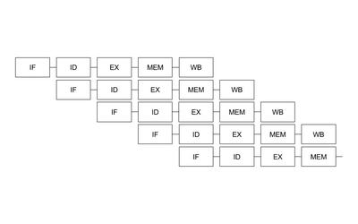 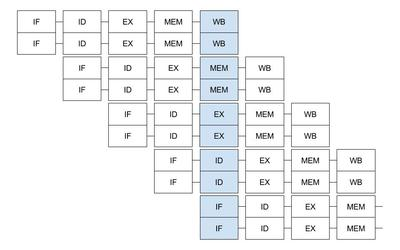

No pipeline de 5 estágios ocorrem hazard de dados quando uma instrução no estágio `ID | EX` utiliza algum dado que será calculado ainda, ou seja, existe alguma instrução em `EX | MEM` ou `MEM | WB` cuja saída será sua entrada. Quando acontece isso o pipeline precisa "parar" seu andamento e isso é chamado de stall. Para facilitar a implementação, nosso pipeline não possui fowarding e os dados são retornados ao `ID` no final de `WB`, portanto podemos ter 1 ou 2 stalls dependendo de onde estiver a dependencia.
Os hazards de controle acontecem quando exite alguma interrupção do pipeline por conta do funcionamento de alguma instrução como branch e jump. Para as intruções de jump podemos verificar o seu endereço no `EX` e portanto precisamos de 2 stalls para o salto. Já para as intruções de branch podemos [implementar maneiras diferentes](#branch-predictor) afim de obter um melhores resultados.

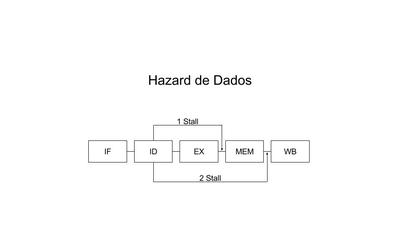

Já no pipeline de 7 estágios, a execução de uma instrução é dividido em 7 etapas `| IT | IF | ID | EX | MT | MM | WB |` em que a etapa `IF` do pipeline 5 foi dividida em duas etapas: a `IT` e `IF` e a etapa `MEM` do de 5 foi dividida em `MT` e `MM`. Assim como no pipeline de 5 estágios, consideramos que as intruções são concluidas no `WB` e, análogamente ao de 5, podemos ter 1, 2 e 3 stalls para hazard de dados. Para hazard de controle, para a intrução de jump temos 3 stalls. 

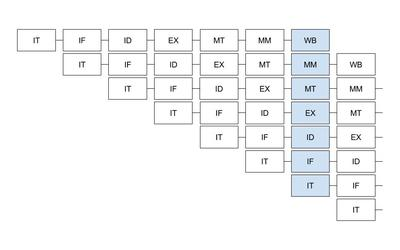

#### Configurações de Cache
No trabalho foi simulado 4 caches, L1 e L2 de dados e de instruções. Fizemos simulações para oito variações das configurações de L1 e L2 (tanto de dados quanto de instruções). Abaixo segue a lista das configurações:

| Configuração | L1 Cache Size | L2 Cache Size | L1 Block Size | L2 Block Size | Associativity |
|--------------|---------------|---------------|---------------|---------------|---------------|
| 1            | 64 KB         | 256 KB        | 32 B          | 128 B         | 2             |
| 2            | 16 KB         | 256 KB        | 32 B          | 128 B         | 2             |
| 3            | 32 KB         | 256 KB        | 32 B          | 128 B         | 2             |
| 4            | 64 KB         | 128 KB        | 32 B          | 128 B         | 2             |
| 5            | 64 KB         | 512 KB        | 32 B          | 128 B         | 2             |
| 6            | 64 KB         | 256 KB        | 16 B          | 128 B         | 2             |
| 7            | 64 KB         | 256 KB        | 32 B          | 64 B          | 2             |
| 8            | 64 KB         | 256 KB        | 32 B          | 128 B         | 1             |

Para realizar a simulação foi utilizada a API do DineroIV, realizando uma referencia às caches de instrução sempre que uma instrução fosse chamada e uma referencia às caches de dado sempre que fosse chamada uma instrução de leitura/escrita.

Obtivemos ao final a quantidade de fetches e de misses em casa cache, bem como o percentual total de misses, que são os valores que serão usados para comparar as caches.

#### Branch Predictor
- Sem predictor (sempre atrasa pipeline ao encontrar um branch).
- Always not taken.
- Two-bit prediction.

### Cenários Analisados
A seguir apresentamos uma tabela que identifica as diferentes combinações das configurações que foram medidas. Estas combinações foram escolhidas de forma a facilitar a análise da influência das mudanças em cada configuração individualmente, além de nos fornecer uma visão geral das vantagens e desvantagens de cada cenário.

| Cenário  | Pipeline                   | Configuração de Cache | Branch Predictor |
|----|----------------------------|-----------------------|------------------|
| 1  | Escalar de 5 estágios      | 1                     | Sem              |
| 2  | Superescalar de 5 estágios | 1                     | Sem              |
| 3  | Escalar de 7 estágios      | 1                     | Sem              |
| 4  | Escalar de 5 estágios      | 2                     | Sem              |
| 5  | Escalar de 5 estágios      | 3                     | Sem              |
| 6  | Escalar de 5 estágios      | 4                     | Sem              |
| 7  | Escalar de 5 estágios      | 5                     | Sem              |
| 8  | Escalar de 5 estágios      | 6                     | Sem              |
| 9  | Escalar de 5 estágios      | 7                     | Sem              |
| 10 | Escalar de 5 estágios      | 8                     | Sem              |
| 11 | Escalar de 5 estágios      | 1                     | Always Not Taken |
| 12 | Escalar de 5 estágios      | 1                     | Two-Bit          |
| 13 | Superescalar de 5 estágios | 1                     | Always Not Taken |
| 14 | Superescalar de 5 estágios | 1                     | Two-Bit          |

## Resultados

### Eventos medidos
De forma a analisar os diferentes cenários simulados, foram determinados os seguintes eventos para serem utilizados como base:
- CPI (`CPI`).
- Número de Ciclos (`NC`).
- Tempo de execução (`T`).
- Número de Instruções (`NI`).
- Número de Intruções de cada tipo (R, I, J).
- Quantidade de Hazards de Dados.
- Número de Stalls devido a Hazards de Dados (`SHD`).
- Quantidade de Hazards de Controle.
- Número de Stalls devido a Hazards de Controle (`SHC`).
- Número de Stalls devido a Jumps (`SJ`).
- Número de Cache Misses na L1 (`NCM1`).
- Porcentagem de Cache Misses na L1.
- Número de Cache Misses na L2 (`NCM2`).
- Porcentagem de Cache Misses na L2.
- Número de Stalls devido a Cache Misses.
- Total de Stalls (`TS`).
- Número de Branches.
- Quantidade de Branch Predictions Corretos.
- Quantidade de Branch Predictions Incorretos.

Boa parte desses eventos foram obtidos diretamente da simulação feita, porém, alguns outros precisaram ser estimados. Abaixo, listamos esses casos, apresentamos a fórmula utilizada e uma breve explicação da motivação por trás dessas estimativas.

#### Total de Stalls
O número total de stalls é a soma do número de stalls devido a hazards de dados com o número de stalls devido a hazards de controle, com o número de stalls devido a jumps e com o número de stalls devido a cache misses. Para este último, estimamos que cache hits não acarretam nenhum stall adicional, que um cache miss na L1 causa por volta de 15 stalls e que um cache miss na L2 causa em torno de 200 stalls. Assim, a fórmula para o número total de stalls é:

`TS = SHD + SHC + SJ + ((15 · NCM1) + (200 · NCM2))`

#### Número de Ciclos
O número de ciclos calculado para pipelines escalares foi o resultado da soma do número de instruções, com o número total de stalls, com o número de estágios do pipeline (`NEP`), subtraído de 1. A fórmula para o número de ciclos é:

`NC = NI + TS + (NEP - 1)`

#### CPI
O cálculo do CPI é simplesmente a divisão do número de ciclos pelo número de instruções:

`CPI = NC / NI`

#### Tempo de Execução
Para o cálculo do tempo de execução, primeiramente foi necessário definir a frequência (`F`) do *clock* em um processador MIPS. Após pesquisas feitas pelo grupo, definimos como razoáveis os valores de 150 MHz para um pipeline de 5 estágios e de 200 MHz para um pipeline de 7 estágios. Assim, o tempo de execução será de:

`T = NC / F`

### Análise

#### Escalar x Superescalar
Com o objetivo de analisar a influência da paralelização das instruções na eficiência do processador, foi feita uma comparação dando ênfase aos cenários 1 e 2, visto que a única diferença entre eles é a de que a primeira é escalar e a segunda, superescalar.
Como podemos ver nos gráficos abaixo, a configurção superescalar consegue um CPI menor quando comparado escalar (lembramos que quanto menor o CPI, melhor) já que consegue executar o pipeline em paralelo (2x mais instruções), e com isso o tempo diminui.
No entanto, é interessante notar que na configuração superescalar exitem maiores probabilidades de ocorrerem hazard de dados do que na escalar e isso pode ser visto no gráfico do númeor de stalls em que em todas as execuções os números de stalls no pipeline foram maiores que no escalar. Apesar disso, a dupla execução do pipeline ainda compensou os hazards.

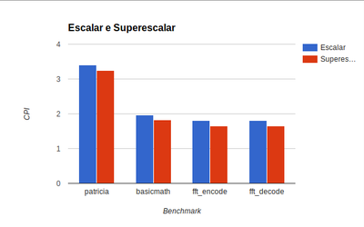 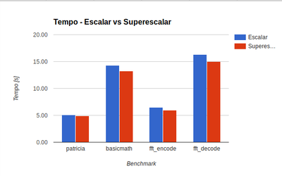 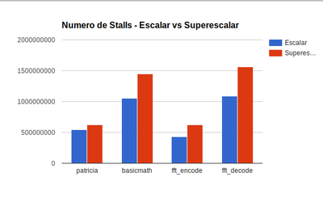

#### Número de Estágios do Pipeline
De forma a analisar a influência do número de estágios do pipeline na eficiência do processador, foi feita uma comparação dando ênfase aos cenários 1 e 3, visto que eles diferem somente no número de estágios.

Com isso, pudemos observar que com o aumento do número de estágios, houve um aumento no número de ciclos, e consequente aumento de CPI. Porém, o tempo de execução sofreu um decréscimo considerável. Abaixo seguem dois gráficos que ilustram essas diferenças:

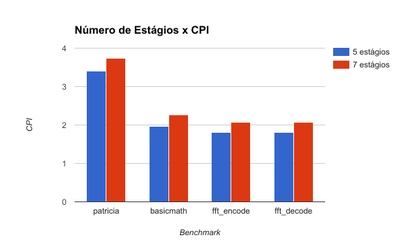 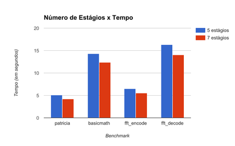

#### Cache
Para as configurações de cache, foram analisados os cenários 1, 4, 5, 6, 7, 8, 9 e 10, visto que eles variam somente a [configuração de cache](#configurações-de-cache), assim podemos avaliar apenas a influência das configurações da cache nos resultados.

#### Branch Predictor
Por fim, para analisar a influência do branch predictor na eficiência do processador, foi feita uma comparação focada nos cenários 1, 11 e 12, uma vez que eles diferem somente no tipo de branch predictor utilizado.
Em termos de tempo e CPI, o Two Bit Predictor se mostrou superior ao Always Not Taken, que, por sua vez, superou o cenário sem Branch Predictor, como mostram os gráficos a seguir:

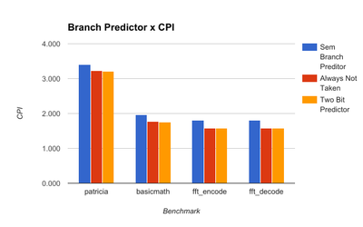 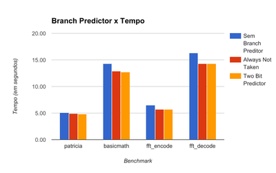

##### Cache de dados

##### Cache de instruções

#### Branch Predictor
Por fim, para analisar a influência do branch predictor na eficiência do processador, foi feita uma comparação focada nos cenários 1, 11 e 12, uma vez que eles diferem somente no tipo de branch predictor utilizado.

### Conclusão
Finalmente, apresentamos uma tabela contendo os resultados mais relevantes obtidos neste experimento:

ADICIONAR TABELA DO JEITO QUE O PROFESSOR PEDIU

A partir desses dados, podemos concluir que

FAZER CONCLUSÃO
