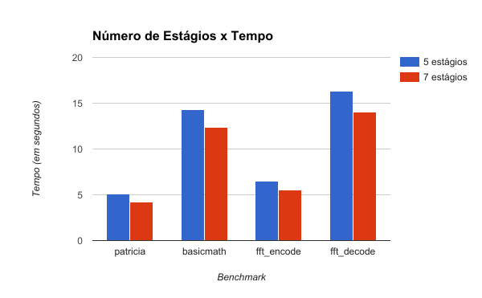
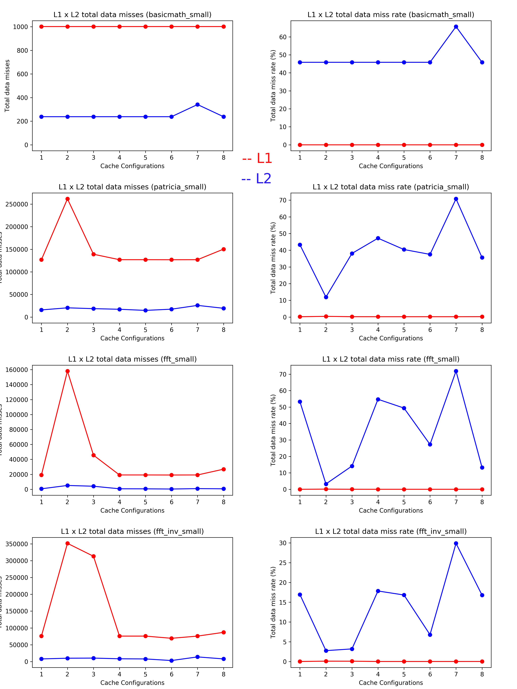
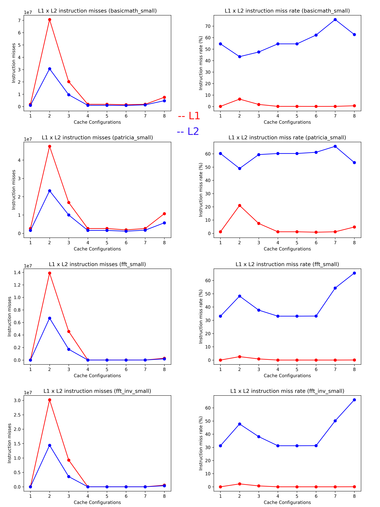

# Projeto 2: Desempenho do Processador

## Grupo 3
- Henrique Noronha Facioli - 157986
- Lauro Cruz e Souza - 156175
- Thiago Silva Farias - 148077

## Introdução
O desempenho de um processador vai além de estatísticas como o seu número de núcleos ou a frequência de seu *clock* - é fundamental ter uma arquitetura bem planejada, de forma a lidar bem com as sequências de instruções mais comuns nos diversos programas com os quais ele deve lidar.

Tendo isso em mente, realizamos a simulação do processamento de quatro benchmarks diferentes, variando as  configurações de forma a criar diversos cenários da arquitetura do processador. Com isso, calculamos diferentes eventos que nos permitiram analisar a eficiência de cada cenário, assim como a influência de cada uma dessas configurações na performance do processador.

Caso o leitor tenha interesse, criamos um breve tutorial de como replicar a execução do experimento em [HOWTO.md](mips_files/HOWTO.md).

## Metodologia

### Benchmarks utilizados
Foram analisados os benchmarks vistos pelos integrantes do grupo na atividade 3. Foram escolhidos aqueles que tiveram o maior tempo de execução.
- `patricia`
- `basicmath`
- `fft_encode`
- `fft_decode`

### Configurações
Foram variadas diversas características da arquitetura do processador, de forma a se analisar o impacto de cada uma dessas mudanças individualmente. Para isso, foram feitas mudanças no código do `mips_isa.cpp`, de forma a contabilizar os eventos relevantes para os cenários testados.

A seguir, apresentamos as características que foram variadas, as configurações utilizadas, bem como uma breve explicação de como o código do `mips_isa.cpp` foi alterado para que os eventos relevantes fossem calculados.

#### Pipeline
Em nosso experimento utilizamos dois tamanhos de pipeline, o de 5 estágios e o de 7 estágios.
No pipeline de 5 estágios, dividimos a execução de uma intrução em 5 etapas `|IF|ID|EX|MEM|WB` na tentativa de executar cada instrução em um ciclo. Com o pipeline de 5 estágios também implementamos a ideia de ser escalar ou superscalar. Nos processadores escalares existe apenas um único pipeline e as instrução são executadas sequencialmente enquanto que no superescalar de dois níveis existem dois pipelines independentes que executam instruções concorrentemente.
Já no pipeline de 7 estágios, a execução de uma instrução é dividido em 7 etapas `| IT | IF | ID | EX | MT | MM | WB |` em que a

#### Configurações de Cache
No trabalho foi simulado 4 caches, L1 e L2 de dados e de instruções. Fizemos simulações para oito variações das configurações de L1 e L2 (tanto de dados quanto de instruções). Abaixo segue a lista das configurações:

| Configuração | L1 Cache Size | L2 Cache Size | L1 Block Size | L2 Block Size | Associativity |
|--------------|---------------|---------------|---------------|---------------|---------------|
| 1            | 64 KB         | 256 KB        | 32 B          | 128 B         | 2             |
| 2            | 16 KB         | 256 KB        | 32 B          | 128 B         | 2             |
| 3            | 32 KB         | 256 KB        | 32 B          | 128 B         | 2             |
| 4            | 64 KB         | 128 KB        | 32 B          | 128 B         | 2             |
| 5            | 64 KB         | 512 KB        | 32 B          | 128 B         | 2             |
| 6            | 64 KB         | 256 KB        | 16 B          | 128 B         | 2             |
| 7            | 64 KB         | 256 KB        | 32 B          | 64 B          | 2             |
| 8            | 64 KB         | 256 KB        | 32 B          | 128 B         | 1             |

Para realizar a simulação foi utilizada a API do DineroIV, realizando uma referencia às caches de instrução sempre que uma instrução fosse chamada e uma referencia às caches de dado sempre que fosse chamada uma instrução de leitura/escrita.

Obtivemos ao final a quantidade de fetches e de misses em casa cache, bem como o percentual total de misses.

#### Branch Predictor
- Sem predictor (sempre atrasa pipeline ao encontrar um branch).
- Always not taken.
- Two-bit prediction.

### Cenários Analisados
A seguir apresentamos uma tabela que identifica as diferentes combinações das configurações que foram medidas. Estas combinações foram escolhidas de forma a facilitar a análise da influência das mudanças em cada configuração individualmente, além de nos fornecer uma visão geral das vantagens e desvantagens de cada cenário.

| Cenário  | Pipeline                   | Configuração de Cache | Branch Predictor |
|----|----------------------------|-----------------------|------------------|
| 1  | Escalar de 5 estágios      | 1                     | Sem              |
| 2  | Superescalar de 5 estágios | 1                     | Sem              |
| 3  | Escalar de 7 estágios      | 1                     | Sem              |
| 4  | Escalar de 5 estágios      | 2                     | Sem              |
| 5  | Escalar de 5 estágios      | 3                     | Sem              |
| 6  | Escalar de 5 estágios      | 4                     | Sem              |
| 7  | Escalar de 5 estágios      | 5                     | Sem              |
| 8  | Escalar de 5 estágios      | 6                     | Sem              |
| 9  | Escalar de 5 estágios      | 7                     | Sem              |
| 10 | Escalar de 5 estágios      | 8                     | Sem              |
| 11 | Escalar de 5 estágios      | 1                     | Always Not Taken |
| 12 | Escalar de 5 estágios      | 1                     | Two-Bit          |
| 13 | Superescalar de 5 estágios | 1                     | Always Not Taken |
| 14 | Superescalar de 5 estágios | 1                     | Two-Bit          |

## Resultados

### Eventos medidos
De forma a analisar os diferentes cenários simulados, foram determinados os seguintes eventos para serem utilizados como base:
- CPI (`CPI`).
- Número de Ciclos (`NC`).
- Tempo de execução (`T`).
- Número de Instruções (`NI`).
- Número de Intruções de cada tipo (R, I, J).
- Quantidade de Hazards de Dados.
- Número de Stalls devido a Hazards de Dados (`SHD`).
- Quantidade de Hazards de Controle.
- Número de Stalls devido a Hazards de Controle (`SHC`).
- Número de Stalls devido a Jumps (`SJ`).
- Número de Cache Misses na L1 (`NCM1`).
- Porcentagem de Cache Misses na L1.
- Número de Cache Misses na L2 (`NCM2`).
- Porcentagem de Cache Misses na L2.
- Número de Stalls devido a Cache Misses.
- Total de Stalls (`TS`).
- Número de Branches.
- Quantidade de Branch Predictions Corretos.
- Quantidade de Branch Predictions Incorretos.

Boa parte desses eventos foram obtidos diretamente da simulação feita, porém, alguns outros precisaram ser estimados. Abaixo, listamos esses casos, apresentamos a fórmula utilizada e uma breve explicação da motivação por trás dessas estimativas.

#### Total de Stalls
O número total de stalls é a soma do número de stalls devido a hazards de dados com o número de stalls devido a hazards de controle, com o número de stalls devido a jumps e com o número de stalls devido a cache misses. Para este último, estimamos que cache hits não acarretam nenhum stall adicional, que um cache miss na L1 causa por volta de 15 stalls e que um cache miss na L2 causa em torno de 200 stalls. Assim, a fórmula para o número total de stalls é:

`TS = SHD + SHC + SJ + ((15 · NCM1) + (200 · NCM2))`

#### Número de Ciclos
O número de ciclos calculado para pipelines escalares foi o resultado da soma do número de instruções, com o número total de stalls, com o número de estágios do pipeline (`NEP`), subtraído de 1. A fórmula para o número de ciclos é:

`NC = NI + TS + (NEP - 1)`

#### CPI
O cálculo do CPI é simplesmente a divisão do número de ciclos pelo número de instruções:

`CPI = NC / NI`

#### Tempo de Execução
Para o cálculo do tempo de execução, primeiramente foi necessário definir a frequência (`F`) do *clock* em um processador MIPS. Após pesquisas feitas pelo grupo, definimos como razoáveis os valores de 150 MHz para um pipeline de 5 estágios e de 200 MHz para um pipeline de 7 estágios. Assim, o tempo de execução será de:

`T = NC / F`

### Análise

#### Escalar x Superescalar
Com o objetivo de analisar a influência da paralelização das instruções na eficiência do processador, foi feita uma comparação dando ênfase aos cenários 1 e 2, visto que a única diferença entre eles é a de que a primeira é escalar e a segunda, superescalar.

#### Número de Estágios do Pipeline
De forma a analisar a influência do número de estágios do pipeline na eficiência do processador, foi feita uma comparação dando ênfase aos cenários 1 e 3, visto que eles diferem somente no número de estágios.

Com isso, pudemos observar que com o aumento do número de estágios, houve um aumento no número de ciclos, e consequente aumento de CPI. Porém, o tempo de execução sofreu um decréscimo considerável. Abaixo seguem dois gráficos que ilustram essas diferenças:

#### Cache
Para as configurações de cache, foram analisados os cenários 1, 4, 5, 6, 7, 8, 9 e 10, visto que eles variam somente a [configuração de cache](#configurações-de-cache), assim podemos avaliar apenas a influência das configurações da cache nos resultados.

Obtivemos assim a quantidade de misses e a taxa em relação a quantidade de fetches para cada uma das oito configurações das caches para os três programas avaliados.

O principal fator a ser levado em consideração na análise da cache serpa a quantidade bruta de misses, pois um o tempo de um miss na cache é muito maior que o tempo de um fetch bem sucedido. Sabendo disso, a quantidade de misses nós dará informações mais condizentes com o esperado, como veremos abaixo.

Poderemos ver abaixo que a taxa de misses e a proporção da quantidade de misses de cada configurações entre programas `fft_encode` (fft) e `fft_decode` (fft_inv) são muito semelhantes. Isso era esperado, uma vez que os dois programas são muito semelhantes, pois um é apenas a função inversa do outro.

Sendo assim, a presença de ambos não causa muito efeito na avaliação, sendo assim, não levaremos em conta os valores do `decode` e daqui para frente o `fft` será uma mencão ao `fft_encode`.

##### Cache de dados

Começando a análise por L1, podemos primeiramente focar nossa atenção nas configurações 1, 2 e 3, já que em ambas apenas o tamanho de L1 é alterado (64KB, 16KB e 32K, respectivamente).

É possível facilmente verificar no gráfico da quantidade de misses a diferença nos tamanhos, uma vez que a menor cache (2) apresenta a maior quantidade de misses e a maior cache (1) apresenta a menor quantidade de misses, como se era esperado.

Aqui temos também um exemplo de como a análise apenas pelas taxas de de miss nos levaria para um caminho errado. No gráfico das porcentagens, temos as taxas de miss para L1 praticamente constantes e todos e a taxa de miss a menor em todos os programas para a configuração 2. Isso se dá pois como a cache de 2 é a menor, a L2 é acessada mais vezes, de forma que a quantiade de misses diminui quanto mais ela é acessada.

Assim, usando apenas as taxas, diriamos que a configuração 2 é a melhor, mas acontece que a sua quantidade de misses é mais alta que a das outras configurações, sendo assim pior.

Mas isso não significa que as taxas são inúteis, poderemos usá-las para desempatar configurações com quantidade de misses muito próximas.

Analisando o tamanho do bloco em L1, podemos verificar os cenários 6 e 7, que alteram apenas o tamanho dos blocos (16 e 32 bits respectivamente). Quando à quantidade de misses não há tanto efeito na mundança, mas podemos verificar uma pequena diminuição do cenário 6 para o 7. A taxa de misses de L1 não tem variação significativa.

Quanto a associatividade de L1, usando os cenários 7 e 8 (2 e 1 respectivamente) podemos verificar um pequeno crescimento na quantidade de misses de 7 para 8. Como esperado, associatividade 2 tem resultados melhores do que 1.

Em L2, podemos verificar pequenas variações na quantidade de misses, isso claro se deve ao fato de que a cache é acessada com uma frequência bem menor. Mas também por isso, podemos ver variações grandes nas taxas de misses, já que poucos misses fazem uma diferença grande quando se tem poucos fetches.

Utilizando as taxas de misses (de L2) como desempate como foi dito anteriormente, temos as configurações 1, 4, 5, 6 e 7 com quantidade de misses muito próximas em todos os programas. Entre elas, as que possuem menores taxas de misses são a 5 e a 6.

Seria esperável que 5 fosse melhor do que 6, já que tem a cache L2 com o dobro do tamanho da cache de 6. Isso pode ser verdade, já que, por exemplo, a quantidade de misses em L2 de 6 é um pouco maior do que 5, e a escala do gráfico está grande (e um miss em L2 é caro). Mas com os dados que temos, essas são boas canditadas a melhores cache para dados.

Mesmo com a diferença entre 5 e 6 mencionadas acima, os valores são condizentes, uma vez que ambas possuem associatividade 2, possuem o tamanho de L1 testado (64 KB), e na L2 possuem os dois maiores tamanhos testados (512K e 256K) e o maior tamanho de bloco (128b).

##### Cache de instruções

Todas as avaliações feitas para a quantidade de misses na L1 da cache de dados pode ser aplicada para as caches L1 e L2 de instrução nos gráficos acima.

As principais diferenças entre as caches de instrução e dados podem ser verificadas nas taxas de misses. Diferentemente das caches de dados, aqui temos variações significativas nas taxas de L1, principalmente nas configurações 2 e 3, com os menores tamanhos de L1.

Em contrapartida, temos a configuração 7 mantendo o posto de maior taxa de misses de L2.

A análise de melhor cache pode ser feita com as mesmas configurações dos dados (1,4,5,6,7). Aqui temos as configurações 1 e 5 competindo entre as melhores, apesar de 6 continuar muito próxima.

Novamente, como era esperado, configurações de associatividade 2, maiores tamanhos de L1 (64K), os dois maiores tamanhos de L2 (256K e 512K) e com maiores tamanhos de bloco (32b em L1 e 128b em L2) apresentam os melhores resultados.

#### Branch Predictor
Por fim, para analisar a influência do branch predictor na eficiência do processador, foi feita uma comparação focada nos cenários 1, 11 e 12, uma vez que eles diferem somente no tipo de branch predictor utilizado.

### Conclusão
Finalmente, apresentamos uma tabela contendo os resultados mais relevantes obtidos neste experimento:

ADICIONAR TABELA DO JEITO QUE O PROFESSOR PEDIU

A partir desses dados, podemos concluir que

FAZER CONCLUSÃO
