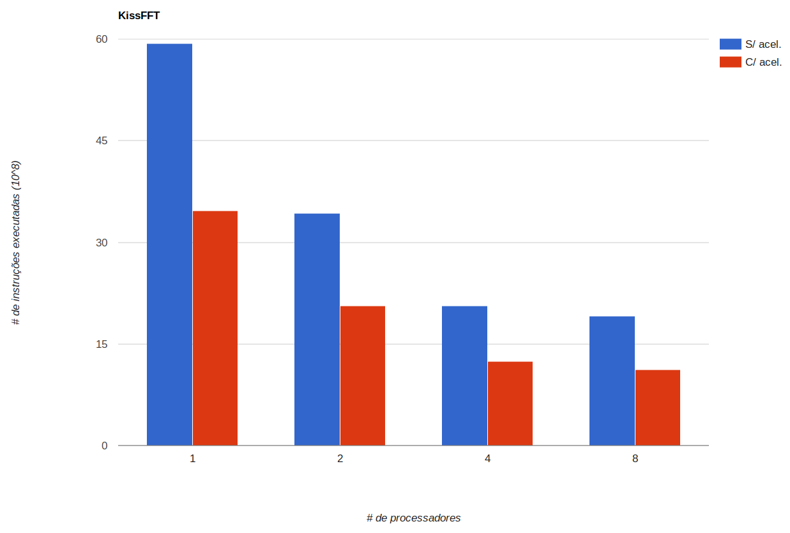

# Projeto 3: Multicore e Aceleração em Hardware

## Grupo 3
- Henrique Noronha Facioli - 157986
- Lauro Cruz e Souza - 156175
- Thiago Silva Farias - 148077


## Introdução
Neste projeto, nosso grupo modelou um sistema com múltiplos cores e executou um software no qual seja possível tirar proveito de paralelismo. Além disto, criamos um módulo de hardware extra para acelerar o desempenho deste software. Com isso, será possível realizar simulações que nos permitam comparar o desempenho de soluções singlecore x multicore x aceleradas.

### Software a executar
O software escolhido pelo grupo para o projeto 3 foi o `FFT` (Fast Fourier Transform), que é uma ferramenta versátil para algoritmos de processamento de sinal digital (DSP) e aplicações.

O `FFT` apresenta características que nos permite tirar proveito do paralelismo obtido através do uso de múltiplos processadores, como as diversas operações matemáticas e a geração de tabelas geométricas. Além disso, podemos fazer uso de pelo menos dois tipos de aceleradores, que serão discutidos abaixo.

Foi usada no projeto uma implementação de `FFT` chamada [`KissFFT`](https://sourceforge.net/projects/kissfft/), que se encontra sobre licença BSD e seu [Copyright](sw/COPYING) está presente na pasta [sw](sw). Foi testado e usado neste projeto apenas a implementação principal do `KissFFT`, que consiste em um FFT complexo de uma dimensão.

### Kernel de Código a ser Acelerado
Com o `FFT`, iremos utilizar dois tipos de aceleradores:
- **Acelerador 1:** operações de ponto flutuante.
- **Acelerador 2:** operações trigonométricas, tais como o cálculo de seno e cosseno.

Ambos os aceleradores se encontram no arquivo [peripheral.cpp](peripheral/peripheral.cpp). Porém, o impacto do acelerador 2 na execução do código não foi suficientemente relevante, o que fez com que decidíssemos por utilizar somente o acelerador 1, que daqui em diante será referido somente por "acelerador".

## Metodologia
Nesta seção, apresentaremos as estratégias traçadas pelo grupo para a execução das simulações, de forma a obtermos resultados que tornem a análise final o mais precisa possível com relação ao impacto do paralelismo (obtido através do uso de múltiplos processadores) e dos aceleradores, com relação a execução do software em suas condições originais.

Além disso, apresentaremos algumas mudanças feitas no código tanto para a obtenção de uma abstração de paralelismo, bem como a criação de um módulo de hardware extra, cujo objetivo é acelerar o desempenho do nosso software.

### Estratégia para realização de experimentos
A fim de analisar o impacto de múltiplos cores, assim como o impacto do acelerador no desempenho do software, serão realizados 8 experimentos:
- **Experimento 1:** execução do software sem paralelismo e sem acelerador.
- **Experimento 2:** execução do software sem paralelismo e com acelerador.
- **Experimento 3:** execução do software com 2 processadores e sem acelerador.
- **Experimento 4:** execução do software com 2 processadores e com acelerador.
- **Experimento 5:** execução do software com 4 processadores e sem acelerador.
- **Experimento 6:** execução do software com 4 processadores e com acelerador.
- **Experimento 7:** execução do software com 8 processadores e sem acelerador.
- **Experimento 8:** execução do software com 8 processadores e com acelerador.

Desta forma, podemos analisar tanto o impacto de múltiplos processadores como o impacto do uso do acelerador para toda configuração de processadores.

### Modificações feitas no código
O `KissFFT` é uma library, assim é necessário importá-la para um arquivo de teste e dentro dele utilizamos suas funções. Sendo assim, aqui não será muito discutido aqui o que foi alterado no arquivo de teste, pois nesse basicamente foi feita sincronização das threads, e nenhuma real paralelização ou utilização dos periféricos foi feita nele.

#### Paralelismo
A implementação do paralelismo no `KissFFT` foi feita principalmente em duas funções:

`kiss_fft_alloc`:

É a funcão responsável por realizar a alocação e inicialização do buffer de dados do `FFT`. Em nossa implementação a função já recebe a estrutura alocada e faz a inicialização que é totalmente paralelizável, já que consiste de um for do-all (ou seja, um for em que todas as iterações são realizadas e sem interação entre si).

Aqui basicamente dividimos um pedaço do for para cada processador:

```C
int start = (proc-1)*(nfft/processors);
int end;

if (proc == processors) // Numero do processador == Quantidade de processadores
    end = nfft;         // Feito para evitar erros de aproximação
else end = proc*(nfft/processors);
```

Essa função claramente não pertence ao core do FFT, mas para valores grandes do N-Point FFT (`nfft`), ou seja, o comprimento do FFT, é uma função que pode ser demorada.


`kf_work`:

Esta é a principal função do `Kiss_FFT`. Ela é a responsável por fazer o processamento do sinal e sendo assim é foco principal da paralelização.

Na implementação do `KissFFT` ela já se encontrava paralelizada usando OpenMP, o que pode ser visto no arquivo de sua implementação [original](sw/kiss_fft_serial.c) utilizada para testar a execuçõ em um processador. Sendo assim, o que fizemos foi adaptar essa região paralelizada para nosso modelo. A seguir temos a principal região da paralelização:

```C
if (fstride==1 && p<=5)
{
    // execute the p different work units in different threads
    for (int k = proc-1; k < p; k += processors)
        kf_work(Fout + k*m, f + fstride*in_stride*k, fstride*p, in_stride, factors, st, proc);
        .
        .
```

Podemos ver acima que o for paralelizado chama a função recursivamente. Cada um dos processadores entra neste loop apenas uma vez, já que nas chamadas recursivas temos uma mudança do parâmetro `fstride` (que é o terceiro parâmetro da função), que  como pode ser visto acima, precisa ser igual a 1 para entrar na região. Caso não entre, temos uma execução "alternativa" abaixo, que é o trabalho que cada processador executará separadamente.

Pode-se ver acima que a divisão é feita entre **p** pedaços de **m** regiões do vetor e esse **p** precisa ser menor que 5.

Este valor **p** é o primeiro divisor do `nfft`, mencionado acima, que pode ter valor 4, 2, 3, 5 ou outros (nessa ordem de teste). Isso é uma limitação da implementação do `KissFFT` que não foi possível contornar, o que resultará em limitações no número de processadores na paralelização, o que será visto abaixo nos resultados.

- **Locks**: Na implementação da paralelização foi usado o periférico de hardware lock implementado no último exercício, este foi utilizado para criar locks locais que são utilizados instansamente na paralelização. A implementação desses locks pode ser vista no [arquivo de demo do sistema](sw/demo_paralle.c).


#### Periféricos

O periférico de ponto flutuante permite que operações de ponto flutuante (adição, subtração, multiplicação e divisão) sejam executadas em apenas um ciclo de clock do processador.

Para isso, a implementação do periférico (feita no arquivo [peripheral.cpp](peripheral/peripheral.cpp)) subdivide regiões de acesso ao periférico para cada uma das operações possíveis, permitindo que se possa realizar multiplas operações de ponto flutuante simultaneamente a partir de um offset.
Temos uma região para os números `a`'s, uma região para os números `b`'s e regiões para as operações (`a+b`, `a-b`, `a*b`, `a/b`) e, um número `a` ou `b` específico ou uma operação entre `a` e `b` especifico é escrito/lido utilizando um mesmo deslocamento a partir de um endereço base.
Abaixo está uma tabela em que indica como deve ser o uso do periférico. A primeira coluna indica se naquele endereço o valor deve ser lido ou escrito, a segunda coluna indica o que será escrito ou lido daquele endereço e a terceira diz qual o endereço.

|         |              |                      |
|---------|--------------|----------------------|
| Escrita | a+offset              | 1992294100U + offset |
| Escrita | b+offset              | 1992294200U + offset |
| Leitura | (a+offset)+(b+offset) | 1992294300U + offset |
| Leitura | (a+offset)+(b+offset) | 1992294400U + offset |
| Leitura | (a+offset)+(b+offset) | 1992294500U + offset |
| Leitura | (a+offset)+(b+offset) | 1992294600U + offset |

Também, para auxiliar na implementação durante ao código foram criada funções para realizar a conversão e envio de dados ao periférico e conversão e retorno do valor desejado. Essas funções se encontram em [peripheral_use_parallel.h](sw/peripheral_use_parallel.h). Para um rápido entendimento do seu funcionamento foi criado este [arquivo](peripheral/README.md) que mostra um uso isolado do periférico.

Depois de implementado, as funções descrita em [peripheral_use_parallel.h](sw/peripheral_use_parallel.h) foram aplicadas no código do KissFFT modificando as operações originais do ponto flutuante, substituindo-as pelas novas funções, também, no KissFFT as operações com números imaginários são operações de ponto flutuante e portanto também foram substituidas pelas operações do periférico. Todas essas modificações foram feitas nos arquivos [_kiss_fft_guts_serial.h](sw/_kiss_fft_guts_serial.h), [_kiss_fft_guts_parallel.h](sw/_kiss_fft_guts_parallel.h), [kiss_fft_parallel.c](sw/kiss_fft_parallel.c), [kiss_fft_parallel.h](sw/kiss_fft_parallel.h)


## Resultados

Diferentemente do que poderia ser esperado, precisamos analisar a quantidade de instruções executadas pelos processadores para avaliar o ganhou (ou não) com a paralelização e a utilização de aceleradores, pois o tempo de execução apresentado pelo simulador do mips é o tempo real de execução, e como toda a execução é feita sobre um único processador, toda a execução é, na na máquina real, feita concorrentemente.

Sendo assim, os dados analidados abaixo são a quantidade de instruções executadas pelo processador que executou a maor quantidade de instruções (no caso de mais de um processador).

Todos os testes do trabalho foram realizados para os seguintes valores de entrada:

- **nfft** = 65536

Representa o valor do comprimento do FFT, que também é o número de coeficientes de frquência e o número de samples de sinal

- **numffts** = 10

Quantidade de vezes que executamos o FFT

## Análise



Acima temos a quantidade de instruções para todos os casos de teste do KissFFT, com paralelização e utilização do periférico.

### Paralelização
Para avaliar a paralelização do programa testamos o programa original com apenas um processador e então a versão paralelizada com 2, 4 e 8 processadores. Assim, podemos avaliar se o programa apresenta uma boa escalabilidade.

Como podemos ver acima no gráfico e nas porcentagens resultantes, a relação entre a execução do `KissFFT` com e sem aceleradores para duas quantidades diferentes de processadores é basicamente a mesma, então faremos a análise da paralelização pensando apenas nos testes sem uso dos periféricos, já que ela é a mesma para os testes com os periféricos.

Vamos então comparar a porcentagem de diminuição da quantidade de instruções de uma execução com X processadores para uma com 2*X processadores:

- **1 -> 2**: Melhoria de **42.27%**
- **2 -> 4**: Melhoria de **39.71%**
- **4 -> 8**: Melhoria de **7.30%**

Como podemos verificar pelos dados acima, a utilização de 2 e 4 processadores aparesentaram resulados muito bons, considerando que o esperado na teoria seria uma melhora de 50% com a dobra de processadores, essa melhoria chegou próximo ao esperado, considerando o overhead criado com a necessidade de garantir a sincronização dos processadores utilizando os locks.

O resultado aqui que foge (negativamente) do esperado é quando são utilizados 8 processadores. Isso se dá pelo que foi comentado acima quando explicamos a implementação da paralelização do `KissFFT`. Basicamente, na paralelização original do código, que foi a que seguimos para obter os mesmos resultados, a divisão das tarefas é feita em **p** pedações de **m** posições do vetor de buffer do FFT. Acontece que esse **p** pode ter valor 4, 2, 3, 5 ou outros, dependendo de qual desses valores primeiro divido **nfft**. E a paralelização é feito apenas para um valor **p <= 5**.

Como nos nossos testes **nfft == 4**, então o trabalho é divido apenas para 4 processadores, e os outros 4 ficam parados sem realizar nenhum trabalho.

Ainda conseguimos obter um pequeno ganho pois, como explicamos antes, a função `kiss_fft_alloc` também está paralelizada, e essa faz proveito total dos processadores, mas ela não tem a maior expressão na execução total do software.

Assim, pela forma como o `KissFFT` foi implementado, ele não apresenta uma escalabilidade muito boa para multicores, já que acima de, no máximo, 5 processadores, o ganho será minúsculo, pois ele virá inteiro da função de `alloc`.

### Periféricos
É possível analisar o impacto do uso do acelerador em cada uma das configurações de paralelismo utilizadas. Vamos então apresentar na tabela abaixo o impacto percentual referente a diminuição da quantidade de instruções de uma execução sem acelerador para uma execução com acelerador, dependendo do número de processadores:

| # Processadores    | 1      | 2      | 4      | 8      |
|--------------------|--------|--------|--------|--------|
| Impacto Percentual | 41.54% | 39.72% | 39.77% | 41.42% |

Temos então que o impacto percentual é sempre em torno de 40%, o que representa um ganho bastante significativo na eficiência da execução. Como esperado, este impacto é relativamente independente do número de processadores utilizado na execução, visto que o ganho relativo em cada um dos processadores terão valor bastante próximos.


## Conclusão

- O `KissFFT` apresenta um ganho muito bom para 2 e 4 processadores, mas para mais processadores o ganho se torna muito pequeno, pois o sistema não foi programado para ser mais escalável.
- As variações percentuais do número de processadores tem valores muito próximos quando considerando isoladamente os casos sem uso do periférico e com uso do periférico. As maiores diferenças entre esses casos é de apenas 2%.
- O impacto do uso de um acelerador é em torno de 40%, e independe do número de processadores empregado na execução.
- A configuração com o melhor resultado, considerando possíveis custos de implementação, seria aquela com 4 processadores e com uso de acelerador. Apesar de o número de instruções diminuir com o uso de 8 processadores, a queda percentual não é grande o suficiente para justificar o custo maior desse tipo de implementação.
